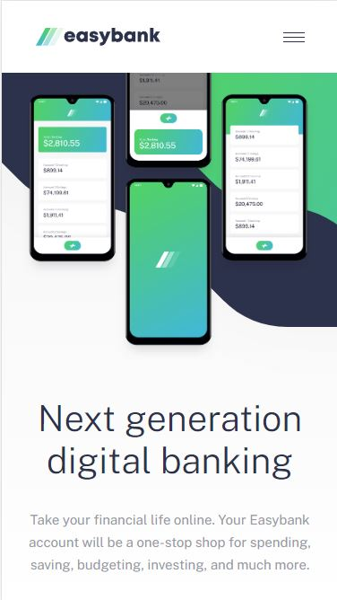

# EasyBank - Responsive Mobile Banking Website

This repository contains a responsive web design project that aims to replicate the homepage of EasyBank, a mobile banking application. The project includes versions for desktop and mobile devices.

## Features
 - Responsive design that adapts to different screen sizes and devices.
 - Mobile-first approach for optimal viewing experience on smartphones and tablets.
 - Interactive elements and animations to enhance user engagement.
 - Seamless navigation with a user-friendly interface.

## Technologies Used
The EasyBank website project utilizes the following technologies:

HTML
CSS
Media Queries

## Installation
 - Clone the repository: `git clone https://github.com/aldona-krukowska/Easybank.git`
 - Navigate to the project directory: `cd Easybank`
 - Open the `index.html` file in your preferred web browser.

## Contributing
Contributions to improve and enhance the EasyBank project are welcome. If you find any issues or have suggestions, feel free to submit a pull request.

## Credits
The EasyBank project is inspired by and replicates the design of the EasyBank mobile banking application.

## Disclaimer
This project is for educational purposes only and is not affiliated with or endorsed by EasyBank. The content and design are solely for demonstration and learning purposes.
